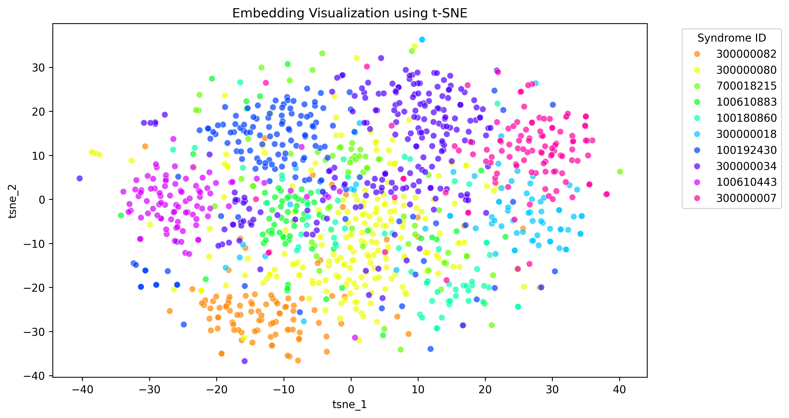
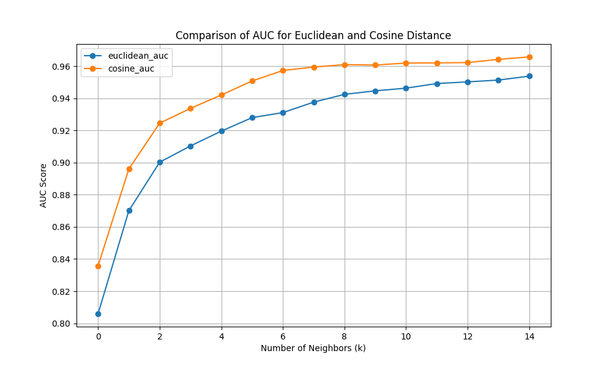

# Genetic Syndrome Classification Pipeline

## Overview
This repository contains a pipeline for the classification of genetic syndromes based on image embeddings. The project aims to analyze the effectiveness of different distance metrics in K-Nearest Neighbors (KNN) classification and visualize the embedding structure using t-Distributed Stochastic Neighbor Embedding (t-SNE).

## Project Structure
```
├── data/
│   ├── input/                # Input files
│   │   ├── mini_gm_public_v0.1.p  # Input data
│   ├── output/               # Pipeline results
│   │   ├── tables/           # Generated tables
│   │   ├── plots/            # Generated plots
├── main.py                    # Main execution script
|── dataset.py                 # Dataset processing script
|── knn_classifier.py          # KNN classification script
|── knn_results_analysis.py    # Analysis of KNN results
├── requirements.txt            # Project dependencies
└── README.md                   # This file
```

## Requirements
Ensure that Python is installed in your environment.

## Installing Dependencies
Run the following command to install the necessary dependencies:
```sh
pip install -r requirements.txt
```

## Execution
To run the pipeline, execute:
```sh
python main.py
```

## Output
After execution, the results will be available in the following directories:
- **Tables:** `data/output/tables/`
- **Plots:** `data/output/plots/`

## 1. Introduction
This project classifies genetic syndrome embeddings and visualizes them. The objectives are:
- Evaluate the effectiveness of Euclidean and Cosine distance metrics in KNN classification.
- Use t-SNE to visualize the structural organization of embeddings.

## 2. Methodology
### 2.1 Data Preprocessing
- The dataset (`data/input/mini_gm_public_v0.1.p`) is loaded using the `GeneticSyndromeDataset` class.
- The hierarchical structure is transformed into a structured tabular format.
- Embeddings are extracted and converted into NumPy arrays for machine learning integration.
- Labels are mapped to each embedding for classification.
- Data integrity checks are performed to identify missing values or inconsistencies.

### 2.2 Algorithm Selection
- **t-SNE:** Projects high-dimensional embeddings into a 2D space for visualization.
- **KNN Classification:** Evaluates performance using Euclidean and Cosine distance metrics.

**Parameter Configuration:**
- **t-SNE:** Perplexity set to 30, learning rate at 200, and fixed random seed for reproducibility.
- **KNN:** Euclidean and Cosine distance metrics tested; optimal K selected through cross-validation.

## 3. Results
### 3.1 Data
- **Number of Syndromes:** 10 distinct classes.
- **Total Samples:** 1,116 images.
- **Class Distribution:** Some syndromes are overrepresented (e.g., syndrome 300000034 has 210 samples, while 700018215 has only 64), leading to class imbalance.
- **No Missing Values:** The dataset is clean.

### 3.2 t-SNE Visualization
The t-SNE projection revealed distinct clusters, suggesting identifiable patterns in the embedding space.


### 3.3 KNN Classification Performance
| Distance Metric | Accuracy | F1-Score | AUC |
|----------------|----------|----------|------|
| Euclidean      | 72%      | 70%      | 92%  |
| Cosine        | 77%      | 76%      | 94%  |



Cosine distance outperformed Euclidean distance in all evaluation metrics.

## 4. Insights
- **Cosine distance** performed better than Euclidean distance, as it focuses on vector orientation rather than magnitude, reducing noise in high-dimensional spaces.
- **t-SNE visualization** revealed well-defined syndrome-specific clusters, confirming the feasibility of classification.
- Some syndromes had overlapping clusters, suggesting that advanced classification techniques might improve performance.
- Syndromes with fewer samples had lower classification accuracy, indicating a potential need for **data augmentation** or synthetic data generation.

## Conclusion
This project demonstrates that genetic syndromes can be effectively classified using image embeddings. Cosine distance in KNN provides better results than Euclidean distance, and t-SNE visualizations confirm meaningful clustering. Future work could involve deep learning techniques to improve classification accuracy.

